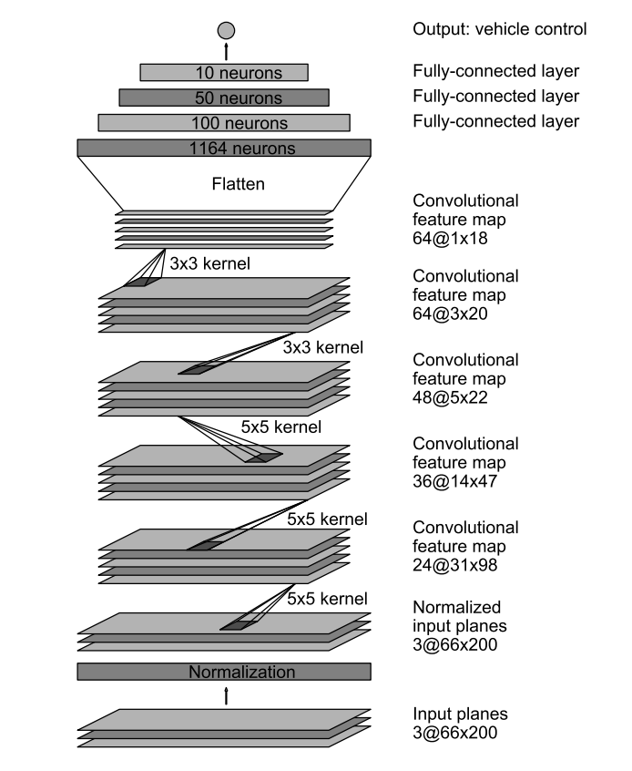

# Behavioral Cloning

## Udacity Self-Driving Car Nanodegree Project 3

In this project, a Deep Neural Network will be trained and validated to clone a human driving behavior in order to control a self-driving car to steer in the Simulator. The only data we will use for training are steering data from human input and image data from front-facing cameras.

## Install

Download the simulator based on the Unity engine that uses real game physics to create a close approximation to real driving. [macOS](https://d17h27t6h515a5.cloudfront.net/topher/2016/November/5831f290_simulator-macos/simulator-macos.zip)

Beta Simulators: [macOS](https://d17h27t6h515a5.cloudfront.net/topher/2017/January/587525b2_udacity-sdc-udacity-self-driving-car-simulator-dominique-default-mac-desktop-universal-5/udacity-sdc-udacity-self-driving-car-simulator-dominique-default-mac-desktop-universal-5.zip)

This project requires **Python 3.5** with the following libraries installed:

- [Numpy](http://www.numpy.org/)
- [Pandas](http://pandas.pydata.org/)
- [TensorFlow](https://www.tensorflow.org/)
- [Keras](https://keras.io/)
- [OpenCV](http://opencv.org/)
- [Eventlet](http://eventlet.net/)
- [SocketIO](https://pypi.python.org/pypi/python-socketio)
- [PIL](https://pillow.readthedocs.io/)
- [Flask](http://flask.pocoo.org/)

## Code

- `model.py` - The script used to create and train the model.
- `helper.py` - The script contained all helper functions.
- `drive.py` - The script to drive the car.
- `model.json` - The model architecture.
- `model.h5` - The model weights.
- `README.md` - explains the structure of the network and training approach.

## Run

Run the server
```
python drive.py model.json
```
Once the model is up and running in `drive.py`, you should see the car move around the track!

## Data

1. `IMG` folder -  this folder contains all the frames of your driving.
2. `driving_log.csv` - each row in this sheet correlates your image with the steering angle, throttle, brake, and speed of your car. You'll mainly be using the steering angle.
3. `model.json` - model architecture.
4. `model.h5` - model weights.

# Data Augmentation

Random Flip
Random Shear
Random Rotate
Random Gamma Adjustment
Resize
RGB2YUV

# Architecture



The Adam optimizer and MSE loss function are used for compilation.

A Fit Generator is used to fit the model on image data generated batch-by-batch. This will increase efficiency of model training.

## Ref

1. [End to End Learning for Self-Driving Cars](http://images.nvidia.com/content/tegra/automotive/images/2016/solutions/pdf/end-to-end-dl-using-px.pdf)

## License

The contents of this repository are covered under the [MIT License](LICENSE).
