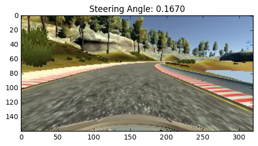

# Behavioral Cloning

## Udacity Self-Driving Car Nanodegree Project 3

In this project, a Deep Neural Network will be trained and validated to clone a human driving behavior in order to control a self-driving car to steer in the Simulator. The only data we will use for training are steering data from human input and image data from front-facing cameras.

## Install

Download the simulator based on the Unity engine that uses real game physics to create a close approximation to real driving.
- Download it here: [macOS](https://d17h27t6h515a5.cloudfront.net/topher/2016/November/5831f290_simulator-macos/simulator-macos.zip)

- Beta Simulators: [macOS](https://d17h27t6h515a5.cloudfront.net/topher/2017/January/587525b2_udacity-sdc-udacity-self-driving-car-simulator-dominique-default-mac-desktop-universal-5/udacity-sdc-udacity-self-driving-car-simulator-dominique-default-mac-desktop-universal-5.zip)

This project requires **Python 3.5** with the following libraries/dependencies installed:

- [Numpy](http://www.numpy.org/)
- [Pandas](http://pandas.pydata.org/)
- [TensorFlow](https://www.tensorflow.org/)
- [Keras](https://keras.io/)
- [OpenCV](http://opencv.org/)
- [Eventlet](http://eventlet.net/)
- [SocketIO](https://pypi.python.org/pypi/python-socketio)
- [PIL](https://pillow.readthedocs.io/)
- [Flask](http://flask.pocoo.org/)

## Code

- `model.py` - The script used to create and train the model.
- `helper.py` - The script contained all helper functions.
- `drive.py` - The script to drive the car.
- `model.json` - The model architecture.
- `model.h5` - The model weights.
- `README.md` - explains the structure of the network and training approach.

## Run

Run the server
```
python drive.py model.json
```
Once the model is up and running in `drive.py`, you should see the car move around the track!

## Data

1. `IMG` folder -  this folder contains all the frames of your driving.
2. `driving_log.csv` - each row in this sheet correlates your image with the steering angle, throttle, brake, and speed of your car. You'll mainly be using the steering angle.
3. `model.json` - model architecture.
4. `model.h5` - model weights.

# Data Augmentation

The following steps are implemented to randomly select and transform images. Here is the image augmentation pipeline:

| Raw Image |
| :-------: |
| Flip |
| Shear |
| Rotate |
| Adjust Gamma |
| Crop & Resize |
| RGB to YUV |
| Input Image to CNN |

1. Randomly selected images:

  64 images are randomly selected for each batch. The images are also randomly select from center, left, or right cameras.

  Here is a sample of raw image:

  

2. Random Flip:

  Images are randomly flipped.

  Here is a sample of flipped image:

  

3. Random Shear:

  Images are randomly sheared horizontally up to 50 pixels from the center point of the image.

  Here is a sample of flipped image:

  

4. Random Rotation:

  Images are randomly rotated up to 5 degrees around the center of the image.

  Here is a sample of rotated image:

  

5. Random Gamma Adjustment:

  Images are randomly adjusted by gamma value up to ± 0.7.

  Here is a sample of gamma adjusted image:

  

6. Crop and Resize:

  Images are cropped 56 pixels from top and 16 pixels from bottom, and then resized to 80x80 pixels.

  Here is a sample of cropped and resized image:

  

7. Convert from RGB to YUV:

  Images are converted from RGB channel to YUV channel [1].

  

# Architecture

The architecture of model is strictly followed the model in this paper [1]. The only difference is the input size has been reduced from 66x200 to 80x80.

Here is the architecture diagram:


And here is the model summary:

```
____________________________________________________________________________________________________
Layer (type)                     Output Shape          Param #     Connected to                     
====================================================================================================
lambda_1 (Lambda)                (None, 80, 80, 3)     0           lambda_input_1[0][0]             
____________________________________________________________________________________________________
convolution2d_1 (Convolution2D)  (None, 38, 38, 24)    1824        lambda_1[0][0]                   
____________________________________________________________________________________________________
convolution2d_2 (Convolution2D)  (None, 17, 17, 36)    21636       convolution2d_1[0][0]            
____________________________________________________________________________________________________
convolution2d_3 (Convolution2D)  (None, 7, 7, 48)      43248       convolution2d_2[0][0]            
____________________________________________________________________________________________________
convolution2d_4 (Convolution2D)  (None, 5, 5, 64)      27712       convolution2d_3[0][0]            
____________________________________________________________________________________________________
convolution2d_5 (Convolution2D)  (None, 3, 3, 64)      36928       convolution2d_4[0][0]            
____________________________________________________________________________________________________
flatten_1 (Flatten)              (None, 576)           0           convolution2d_5[0][0]            
____________________________________________________________________________________________________
dense_1 (Dense)                  (None, 1164)          671628      flatten_1[0][0]                  
____________________________________________________________________________________________________
dense_2 (Dense)                  (None, 100)           116500      dense_1[0][0]                    
____________________________________________________________________________________________________
dense_3 (Dense)                  (None, 50)            5050        dense_2[0][0]                    
____________________________________________________________________________________________________
dense_4 (Dense)                  (None, 10)            510         dense_3[0][0]                    
____________________________________________________________________________________________________
dense_5 (Dense)                  (None, 1)             11          dense_4[0][0]                    
====================================================================================================
Total params: 925,047
Trainable params: 925,047
Non-trainable params: 0
____________________________________________________________________________________________________
```

The Adam optimizer and MSE loss function are used for compilation.

A Fit Generator is used to fit the model on image data generated batch-by-batch. This will increase efficiency of model training.

## Reference

1. [End to End Learning for Self-Driving Cars](http://images.nvidia.com/content/tegra/automotive/images/2016/solutions/pdf/end-to-end-dl-using-px.pdf)

## License

The contents of this repository are covered under the [MIT License](LICENSE).
